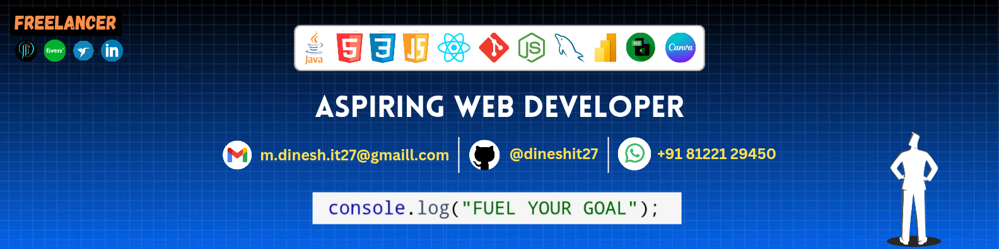

<h3 align="center">
  
</h3>

- 🤖 View my [PORTFOLIO](https://mdinesh-portfolio.netlify.app/)
- 📑 Explore my [RESUME](https://github.com/dineshit27/dineshit27/raw/main/DINESH_RESUME.pdf)
- 🔭 Here's my studio [WEBSITE](https://jdm-studio430.netlify.app/)
- 💻 Aspiring Web Developer
- 🎨 Founder & Freelancer in JDM Studio430
- 💬 Ask me about Tech
- 👨‍💻 About my coding :
  ) 
- 📫 How to reach me :
   
 
- 🤓 Pronouns: Technophile

## 🛠️ Tech Stack

### Programming & Markup

### Databases

### Graphic Design & UI/UX

### Data & Office

### Development Tools

## 🔥 Featured Projects
 

   Personal portfolio website, showcasing my skills, projects, and my journey in the world of web dev and design. 

   Clean, engaging, and responsive platform for JDM Studio430's creative works.

   Modern and elegant hotel e-commerce website, designed to offer a smooth and visually stunning user experience.

   Modern & intuitive e-commerce website tailored for tech enthusiasts.

   Modern, responsive site showcasing premium coffee beans and products.

###
<h3 align="center">
  
 Profile View's

 

<h3/>

<h2 align="center">Lᴇᴇᴛᴄᴏᴅᴇ Sᴛᴀᴛs</h2>

  

