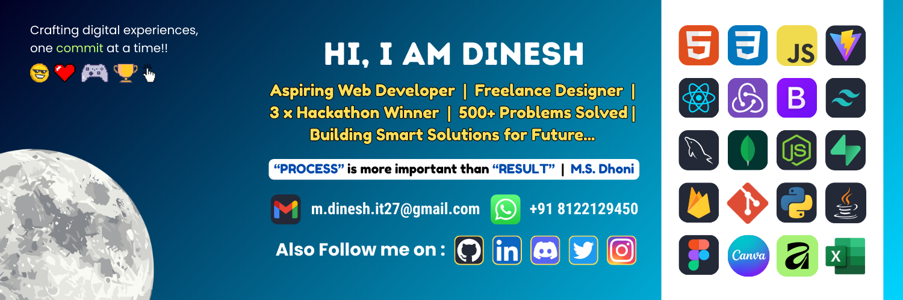

  

 

-----------------------------------------------------------

- 🎓 B.tech IT student @ SIT
- 💻 Full Stack Developer | Freelancer
- 👨‍💻 Developer & Trainee @ MaxGroo Hub
- 🛸 Graphic Designer @ Wyntrix
- 💡 Ex-Intern @ Makos Infotech Pvt Ltd
- 💬 Ask me about Tech & Design
- 🤝 Open to collaborate for works
- 📑 Work Stats :   
- 🤖 My Digital Stats :   

  <h3>🤖 Skills & Technologies</h3>

 

 

 

  <h3>💡 Futured Projects</h3>
<table align="center">

<table align="center">

<tr>
<th>Project</th>
<th>Description & Links</th>
</tr>

<tr>
<td>Aquawatt Hub</td>
<td>
<para>Advanced Water & Electricity Usage Monitoring App. Built with React, Node.js, Supabase, ESP32, MQTT Protocol & Embedded System</para>
  

</td>
</tr>

<tr>
<td>NeuroScan AI</td>
<td>
<para> AI-powered Brain Tumour Detector System. Built with React, Node.js, Supabase, Gemini API</para>

</td>
</tr>

<tr>
<td>Data Analyst - AI Automation</td>
<td>
<para>AI Automation Workflow for Data Analysis. Built with n8n, Excel Key, Gemini Model and more</para>

</td>
</tr>

<tr>
<td>Portfolio Website</td>
<td>
<para>A website to showcase my skills, services, projects, experience, achievements, certificates, and more</para>

</td>
</tr>

<tr>
<td>MaxGroo Hub Site</td>
<td>
<para>1st Animated Freelance project. Built with React, Open source CLI, Framer, 3d motion, Firebase, and more</para>

</td>
</tr>

<tr>
<td>MR Builder Site</td>
<td>
<para>Freelance project. Built with React, Redux, Open source CLI, 3d motion, Firebase, and more</para>

</td>
</tr>

<tr>
<td>LibraVault</td>
<td>
<para>Modern Library Management System. Built with React, 3d motion, Framer, GSAP, Node.js, Supabase, Firebase</para>

</td>
</tr>

</table>

  <h3>👨‍💻 Leetcode Stats</h3>

  

### 🏅 LeetCode Achievements

  
  
  
  
  
  
  

  <h3>🏆 GitHub Trophies</h3>
  

  <h3>👾 GitHub Stats</h3>
  

---

### Thanks for stopping by 💙!!
